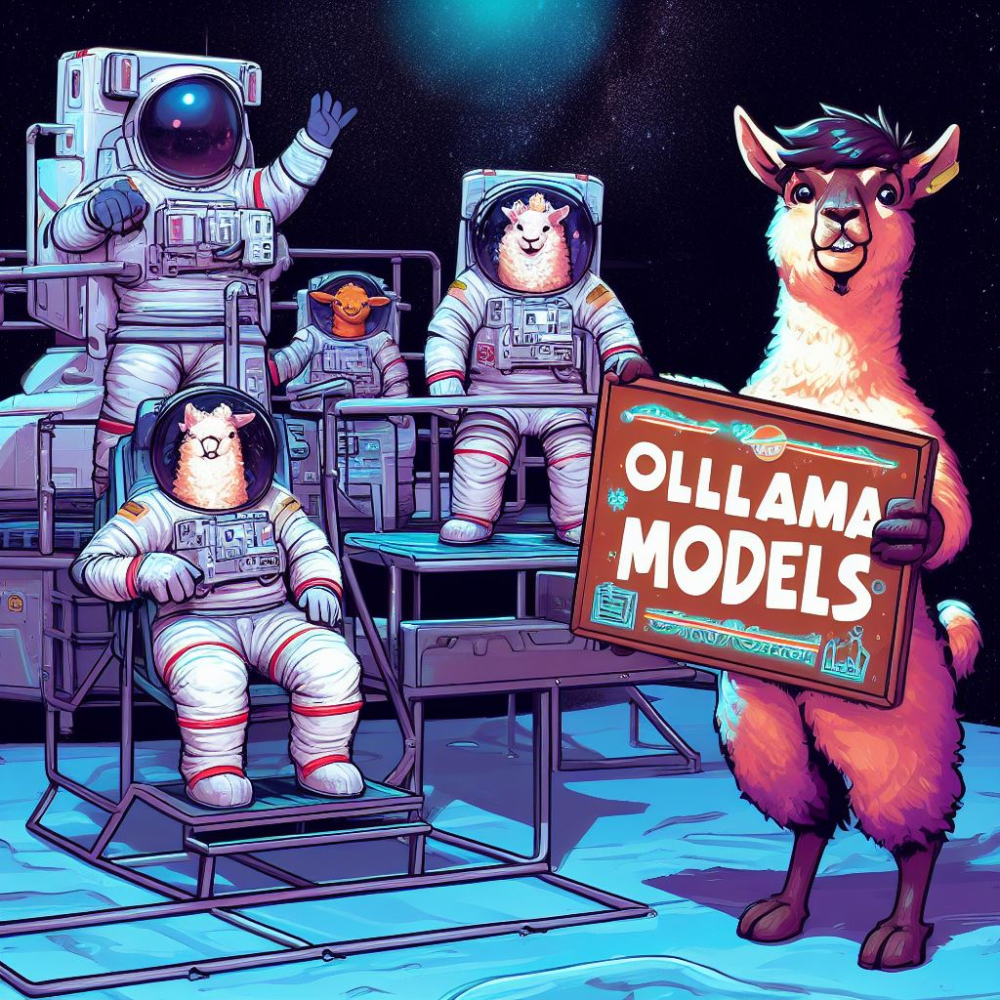

# ollama-models
> List of reusable models



## What?

Repo of models for [ollama](https://ollama.ai/) that is created from HF [prompts-dataset](https://huggingface.co/datasets/fka/awesome-chatgpt-prompts).

## How?

```sh
# Pick the model of your choice
❯ ollama create Philosopher -f ./Philosopher 
parsing modelfile    
looking for model    
reading model metadata    
creating model system layer    
creating parameter layer    
creating config layer    
....
writing manifest    
removing any unused layers    
success  
```

```sh
❯ ollama run Philosopher 
>>> What's the purpose of human life?
 Ah, an intriguing question! As a philosopher, I must say that the 
purpose of human life has been a topic of debate and inquiry for 
centuries. It is a question that touches on many aspects of philosophy, 
including ethics, metaphysics, and epistemology. Here are some possible 
approaches to addressing this question:

1. Biological Perspective: From a biological perspective, the purpose of 
human life can be seen as survival and reproduction. Our basic instincts 
and needs, such as hunger, thirst, and sexual desire, are all geared 
towards ensuring our survival and replication. However, this perspective 
doesn't necessarily provide a satisfying answer to the question of the 
meaning or purpose of life beyond biological necessities.
2. Hedonistic Perspective: Some philosophers argue that the purpose of 
life is to seek pleasure and avoid pain. According to this view, an 
individual's goals and values should be centered around maximizing their 
own happiness and fulfillment. However, this perspective can be 
criticized for being overly selfish and neglecting the well-being of 
others.
3. Altruistic Perspective: Others argue that the purpose of life is to 
help others and make the world a better place. From this viewpoint, an 
individual's goals and values should be centered around serving humanity 
....
```

## What else? 

A GitHub action updates the repo with new models every Monday.